<h2 align="center">School Contact Tracing</h2>
<h4 align="center">College Project - Software Engineering</h4>

<div align="center">

  []() 
  [](https://github.com/crisemcon/Getdo)
  [](https://github.com/crisemcon/Getdo/pulls)
  [](/LICENSE)

</div>

---

<p align="center"> Contact tracing is a tool to make sure that students and staff stay safe from infection, thus saving schools from getting into another hard-pressed situation.
    <br> 
</p>
<p align="center">
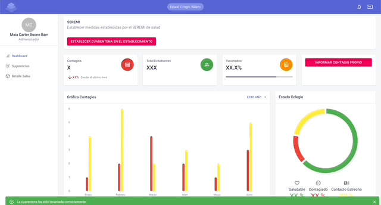
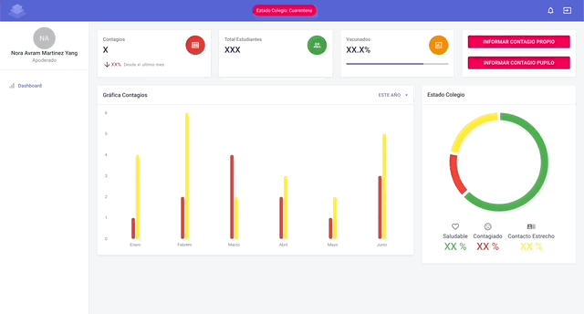
</p>


---
## 📝 Table of Contents
- [About](#about)
- [Built With](#built_with)
- [Getting Started](#getting_started)
- [Usage](#usage)
- [Screenshots](#screenshots)
- [Authors](#authors)
- [Acknowledgments](#acknowledgement)
<!--- [Deployment](#deployment)-->
<!--
- [TODO](../TODO.md)
- [Contributing](../CONTRIBUTING.md)
-->

---
## 🧐 About <a name = "about"></a>
School Contact Tracing is tracking and contact tracing web application designed to help schools, administrators, teachers, students and their parents keep a possible outbreak under control.

*The project is in Spanish and focused on Chile*

---
## ⛏️ Built With <a name = "built_with"></a>
### Frontend
- [React.js](https://reactjs.org//) - Web Framework
- [MaterialUI](https://mui.com/) - React UI library
- [Redux](https://redux.js.org/) - State Container for JS Apps
- [React Router](https://reactrouter.com/web/guides/quick-start) - Library for routing in React
- [Chart.js](https://www.chartjs.org/) - JavaScript charting library

### Backend
- [Flask](https://flask.palletsprojects.com/en/2.0.x/) - Server Framework
- [MySQL](https://www.mysql.com/) - Database
- [SQLAlchemy](https://www.sqlalchemy.org/) - Python SQL toolkit
- [Marshmallow](https://marshmallow.readthedocs.io/en/stable/) - Object serialization/deserialization library

---
## 🏁 Getting Started <a name = "getting_started"></a>
These instructions will get you a copy of the project up and running on your local machine for development and testing purposes.<!-- See [deployment](#deployment) for notes on how to deploy the project on a live system. -->


### Prerequisites

- Node.js - [Download & Install Node.js](https://nodejs.org/en/download/) and the npm package manager. If you encounter any problems, you can also use this [GitHub Gist](https://gist.github.com/isaacs/579814) to install Node.js.
- Python3 - [Download & Install Python3](https://www.python.org/downloads/).
- MySQL - [Download & Install MySQL](https://dev.mysql.com/doc/mysql-installation-excerpt/5.7/en/) and make sure it's running on the default port 3306.


### Installing
A step by step series of examples that tell you how to get a development env running.

First create a virtual environment and activate it. You can use your preffered path:

```
python3 -m venv ~/.virtualenvs/school-contact-tracing 
```

Install the backend dependencies navigating to the backend directory and executing:

```
pip install flask
pip install flask_sqlalchemy   
pip install flask_marshmallow
pip install flask_cors
pip install mysqlclient
```

Install the frontend dependencies navigating ot the frontend directory and executing:
```
npm install
```

Finally create a MySQL database and poblate it with example data. Execute the script.sql file in the database directory. For example, in macOS:

```
mysql -uroot < ./database/script.sql
```

### Running
To run the server application, navigate to the backend folder and run this in the command-line:
```
python3 app.py
```
To run the client application, navigate to the getdo-client folder and run this in another command-line:
```
npm start
```
Open [http://localhost:3000](http://localhost:3000) to view it in the browser.

*Notice that you need client and server runs concurrently in different terminal session, in order to make them communicate to each other.*

<!--
## 🔧 Running the tests <a name = "tests"></a>
Explain how to run the automated tests for this system.

### Break down into end to end tests
Explain what these tests test and why

```
Give an example
```

### And coding style tests
Explain what these tests test and why

```
Give an example
```
-->
---
## 🎈 Usage <a name="usage"></a>
There are 4 types of users: Administrator, Teacher, Student and Parent. There are some examples to login:

| Type           | RUT        | Password |
|----------------|------------|----------|
| Administrator  | 12532639-0 | 1234     |
| Teacher        | 6465312-1  | 1234     |
| Student        | 13255581-8 | 1234     |
| Parent         | 33389375-4 | 1234     |

A different dashboard will be available for each type of user.

---
## 📷 Screenshots <a name="screenshots"></a>

### 📱 Mobile
<div>
    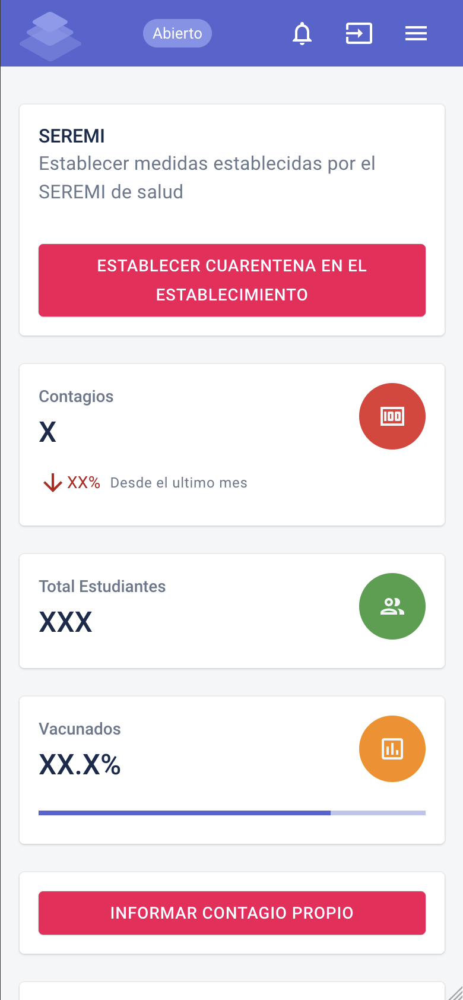
    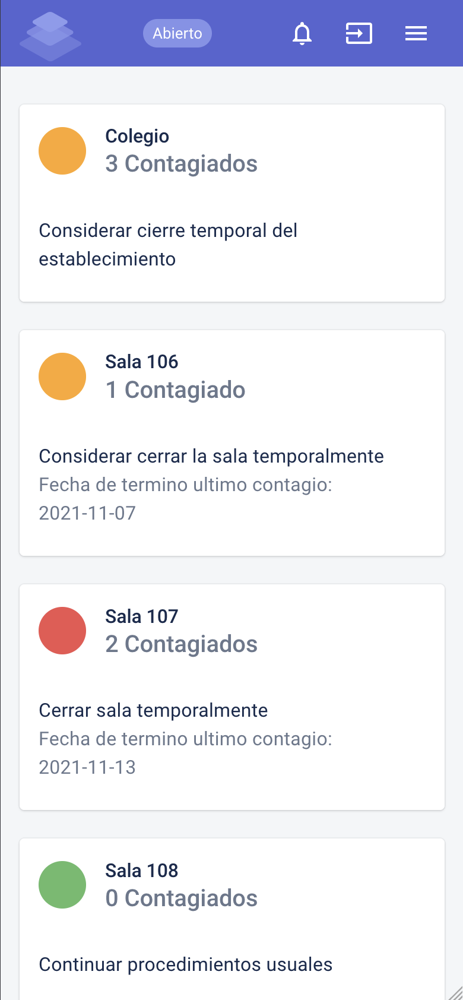
    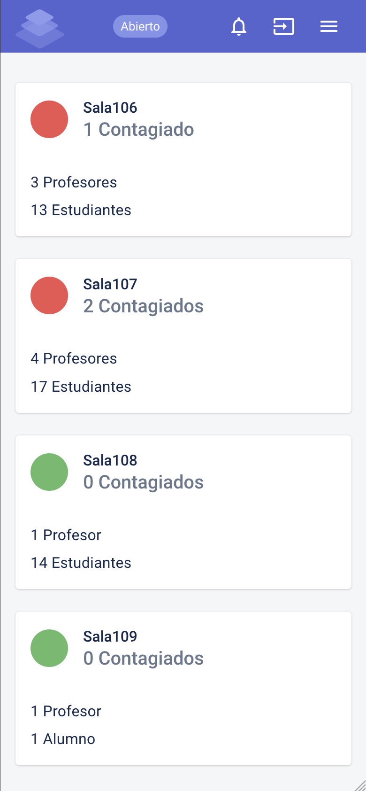
</div>
<div>
    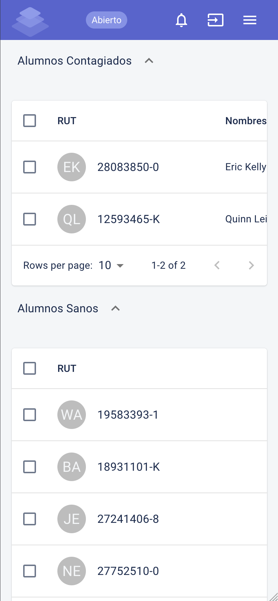
    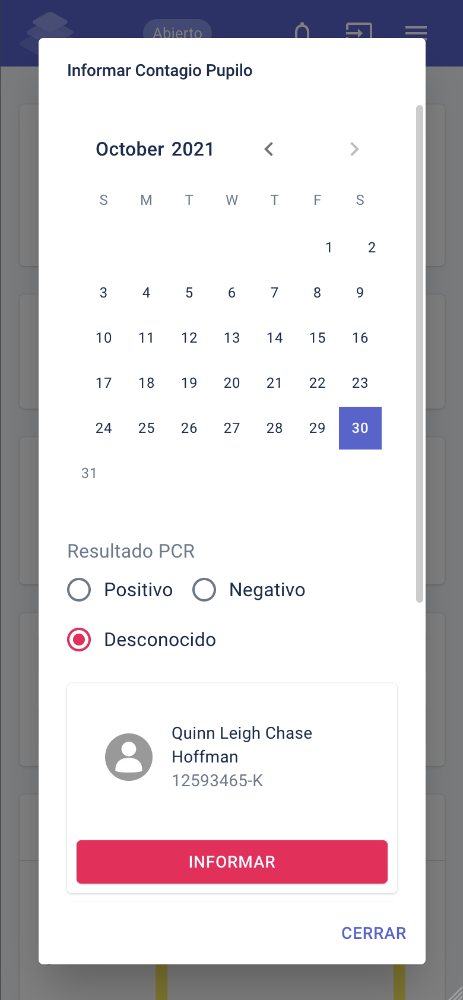
    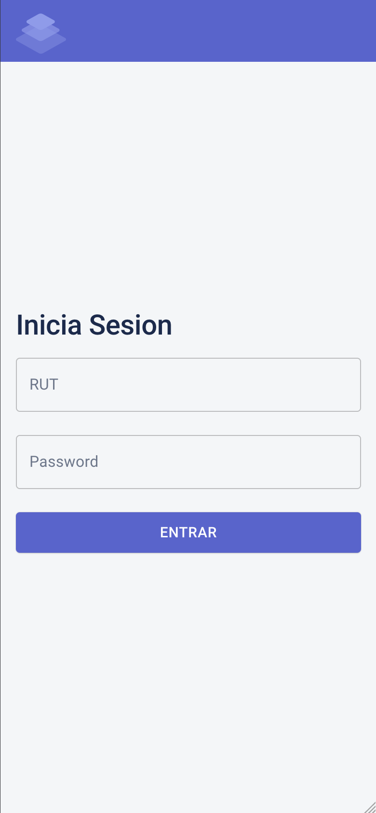
</div>

### 🖥 Desktop
<div>
    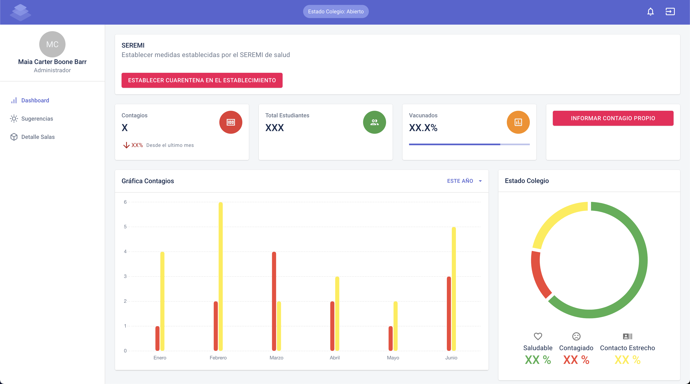
    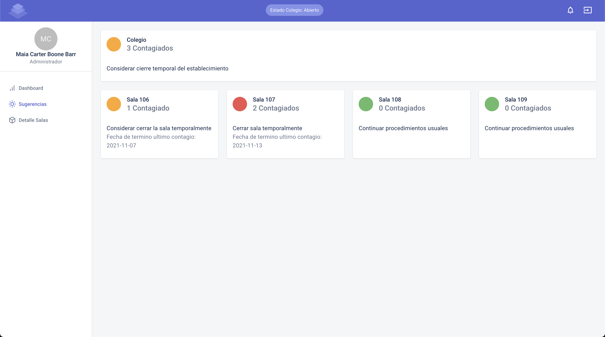
    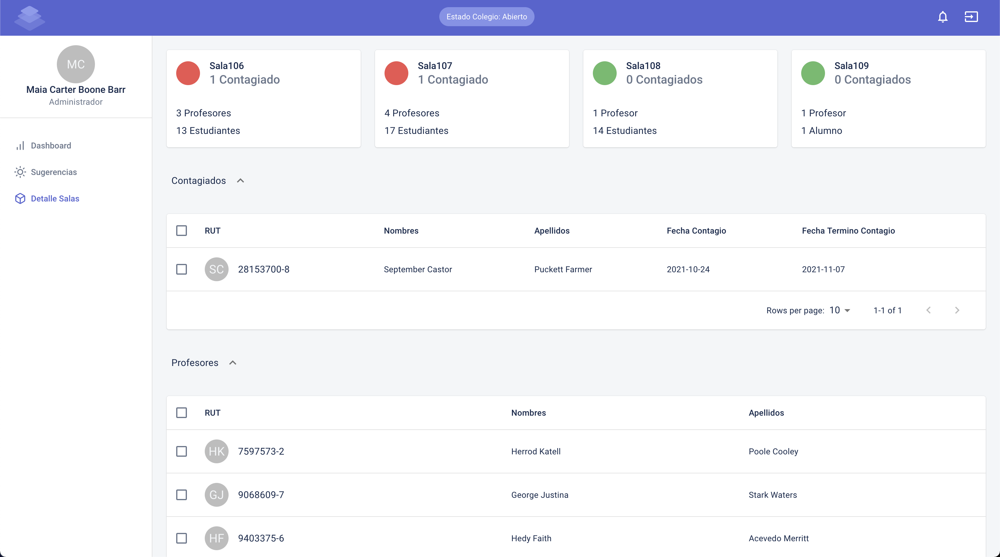
    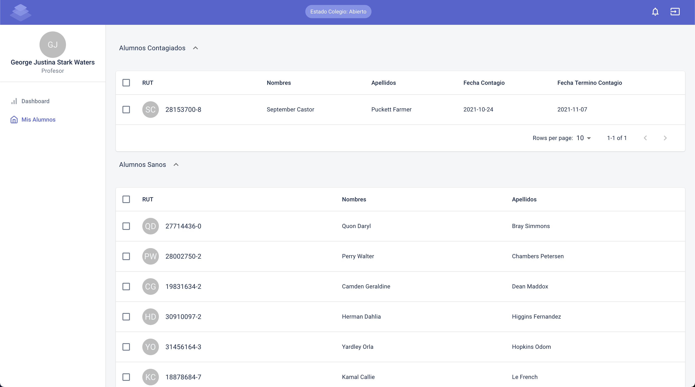
    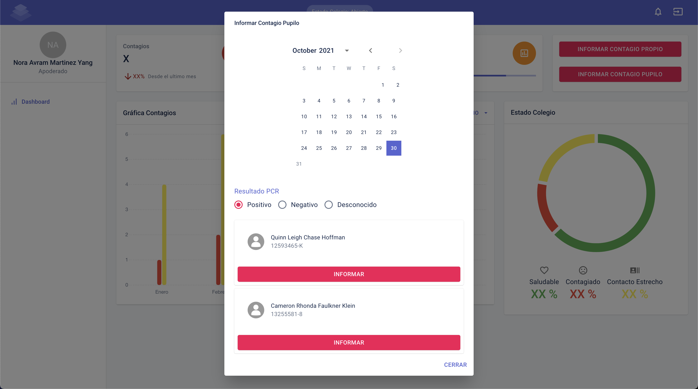
</div>

<!--## 🚀 Deployment <a name = "deployment"></a>
Add additional notes about how to deploy this on a live system.
-->


---
## ✍️ Authors <a name = "authors"></a>
- [@crisemcon](https://github.com/crisemcon)
- [@rfarina97](https://github.com/rfarina97)
- [@cpezo](https://github.com/cpezo)
- [@nsandovalp](https://github.com/nsandovalp)

<!--
See also the list of [contributors](https://github.com/kylelobo/The-Documentation-Compendium/contributors) who participated in this project. 
-->

---
## 🎉 Acknowledgements <a name = "acknowledgement"></a>
- [Material Kit - React](https://github.com/devias-io/material-kit-react) Free React Admin Dashboard made with Material UI's components, React and of course create-react-app to boost app development process.
